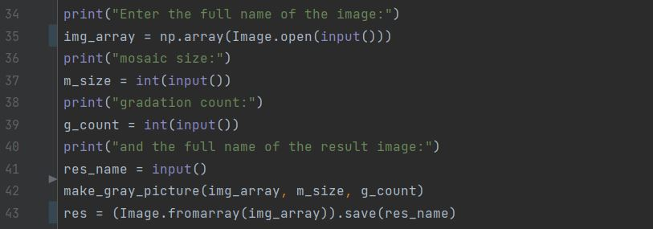
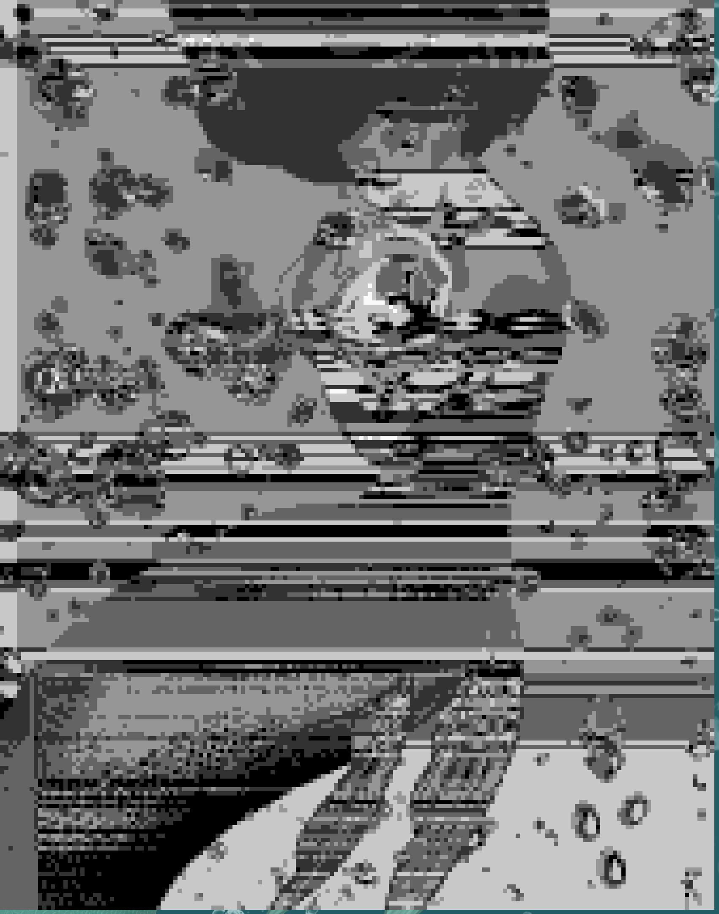
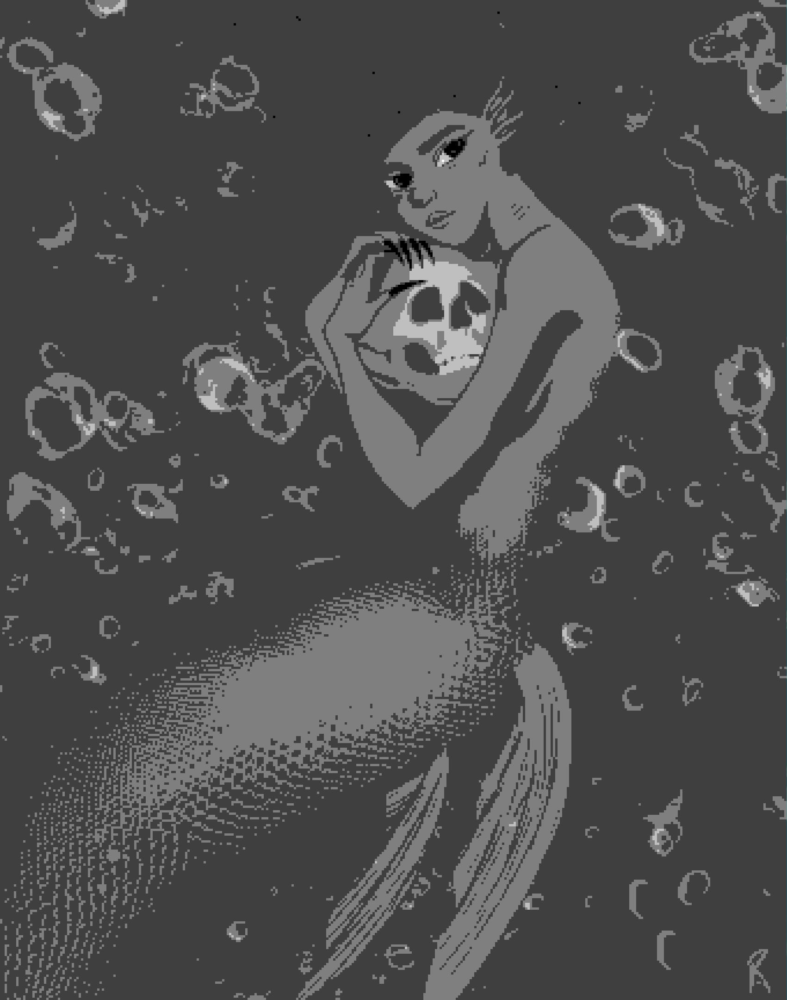

# Gray_filter Отчет
Результат работы профилирования filter.py – 25,8 секунд

Результат профилирования old_filter.py – 33,8 секунд

Несмотря на большее количество вызовов новый фильтр работает быстрее

Теперь сделаем выполнение нового фильтра filter.py автоматическим,т.е. без ввода пользователем в консоль значений.
Создадим новый файл filter_with_filename.py, в котором сразу в коде укажем имена файлов исходного и результирующего,
а также размер сетки 10 и количество градаций серого 50

-консольный ввод в filter.py 

-заполненные в коде параметры в filter_with_filename.py, избавляющие от консольного ввода

На выполнение filter_with_filename.py ушли рекордные 1,8 сек.
(Так как больше не затрачивается время на сбор информации от пользователя)

За тестовое изображение я взяла свой рисунок

Результат работы изначального фильтра old_filter.py:

Результат работы фильтра filter.py, с введенными значениями:
размер сетки - 5
количество градаций серого - 5:

Результат работы фильтра filter_with_filename.py(размер сетки 10, 50 градаций серого):
